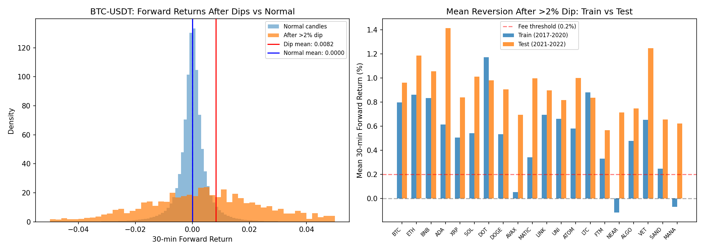
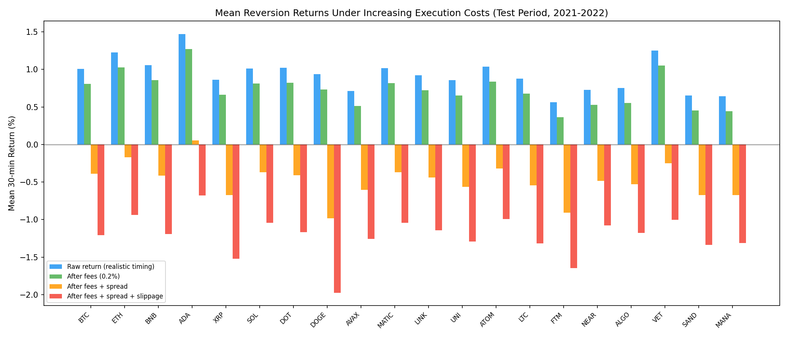

# Exploitable Patterns in Cryptocurrency Price Data

# Hypothesis

There are statistically significant mean-reversion patterns in cryptocurrency price movements that, after accounting for transaction costs, produce returns different from random chance. This hypothesis was drawn from observation of recurring patterns while watching crypto markets. To test it, I defined a pattern as significant only if it passes three filters: (1) statistically significant at p < 0.05 via permutation testing, (2) net-positive after Binance's 0.1% per-trade fee (0.2% round-trip), and (3) persists out-of-sample in a separate test period. To further assess whether these patterns are practically exploitable, I also modeled realistic execution costs including spread, slippage, and order timing delays.

# Background

Mean reversion is the tendency for prices to return toward a central value after being pushed to extremes. Cryptocurrency markets have structural properties that may amplify this effect after sharp drops: crypto trades 24/7 with no circuit breakers, so liquidation cascades can push prices well below equilibrium without any halt mechanism. Retail participation is high, meaning panic selling during dips may be more pronounced and less informed than in traditional markets. Order books on many pairs are relatively thin, so large sell orders can move prices significantly before being fully executed. As liquidity returns and panic subsides, prices tend to revert. However, demonstrating a statistical pattern is different from demonstrating a profitable strategy. The bid-ask spread means market buys execute above the midpoint and sells below it. Slippage is the gap between expected and actual fill price, which is exacerbated during the volatile moments that trigger dip signals. And there is an inherent timing delay: a dip is only detected after the candle closes, so entry happens on the next candle's open, by which time some reversion may have already begun. All of these factors must be accounted for to classify a strategy as profitable. 

# Data

The dataset consists of 1-minute OHLCV (Open, High, Low, Close, Volume) candlestick data for 1,000 cryptocurrency trading pairs from Binance, spanning August 2017 to November 2022 (~1.5 billion candles, ~33 GB of Parquet files). Data quality analysis (see `data_quality.md`) confirmed no pairs exceed 5% missing candles, no OHLC violations, no NaN rows, and no negative prices. This analysis focuses on the 20 most liquid USDT pairs (BTC, ETH, BNB, ADA, XRP, SOL, DOT, DOGE, AVAX, MATIC, LINK, UNI, ATOM, LTC, FTM, NEAR, ALGO, VET, SAND, MANA). Data was split into a training period (2017-2020) and an out-of-sample test period (2021-2022) to guard against overfitting and check validity of the strategy.

# Method

The pattern tested was mean reversion after extreme moves. A 1,000-iteration permutation test assessed statistical significance by comparing the pattern's mean forward return against randomly sampled subsets of the same size from the unconditional return distribution.

Mean Reversion After Extreme Moves: When a coin's price drops more than 2% over a 5-minute rolling window, I measured the 30-minute forward return. The hypothesis is that sharp dips partially revert as liquidity returns and panic selling subsides.

To assess exploitability beyond exchange fees, I layered in three additional execution costs: (1) order timing lag, shifting entry from the dip candle's close to the next candle's open since a dip can only be detected after the candle closes, (2) spread estimation using each candle's `(high - low) / close` as an estimate, deducting half the spread at entry and exit, and (3) slippage modeled as 50% of the entry candle's price range, reflecting the order book conditions during extreme moves.

# Results

# Mean Reversion Is Supported

Mean reversion after extreme dips was a strong finding. In the training period, 17 of 20 pairs showed statistically significant (p < 0.05) positive forward returns after dips exceeding 2% in 5 minutes. All 17 remained net-positive after the 0.2% round-trip fee. In the out-of-sample test period, all 17 of those pairs continued to show profitable reversion, with mean after-fee returns actually increasing from 0.43% to 0.75% per trade. This is consistent with the idea that crypto markets became more volatile in 2021-2022 during the bull run and increased popularity, providing more extreme reversion opportunities.

The left panel shows BTC-USDT's forward return distribution after dips (orange) versus normal candles (blue), with a clear rightward shift. The right panel shows every pair's mean reversion return clears the fee threshold (red dashed line) in both periods.

# Execution Cost Impact

When realistic execution costs are layered in beyond exchange fees, the returns degrade substantially. With just the timing adjustment (entering at the next candle's open instead of the dip candle's close), raw returns remain positive for all pairs. After deducting the 0.2% round-trip fee, returns are still positive. However, once estimated spread costs are included, most pairs turn negative, and after adding slippage, all 20 pairs show negative mean returns. The core issue is that the same extreme volatility that produces the mean-reversion signal also widens spreads and worsens slippage. This means that while the pattern is statistically real, the cost of acting on it during these volatile moments likely exceeds the expected return.

# Conclusion

The hypothesis that statistically significant mean-reversion patterns exist in cryptocurrency price data is supported. Mean reversion after extreme dips passed all three filters: statistical significance, basic fee survival, and out-of-sample persistence across 17 of 20 pairs. The results suggest that crypto markets contain short-term mean-reversion behavior, likely driven by liquidation cascades and panic selling that temporarily push prices away from equilibrium. However, this analysis does not support the claim that these patterns are practically exploitable. When spread, slippage, and order timing are accounted for, the returns turn negative for all pairs. The pattern exists as a genuine market phenomenon, but it does not clearly survive the friction of real-world execution.
